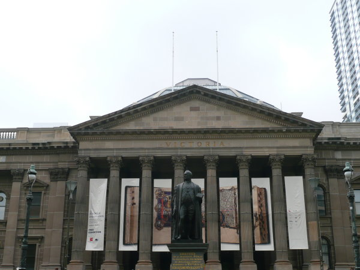
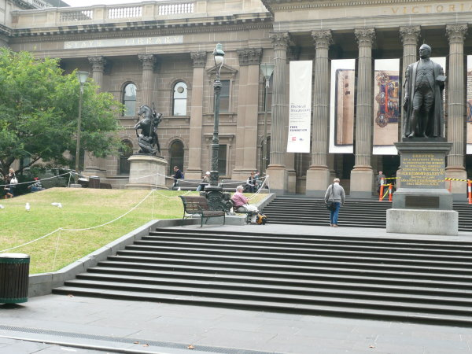
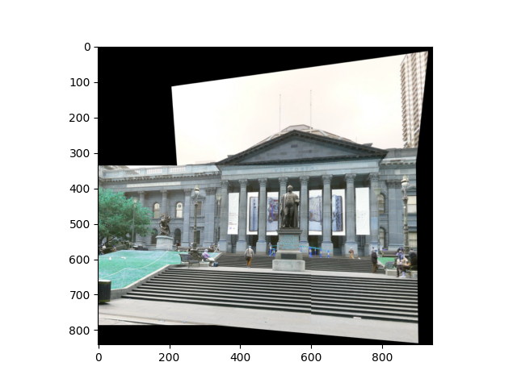

# My AutoPano
The purpose of this project is to stitch two or more images in order to create one seamless panorama image by finding the Homography between the two images. 
The project is divided into two phases,
1. Phase 1: Classical approach of local feature matching
2. Phase 2: Deep Learning approach(Homography Net - supervised and unsupervised) to estimate the homography.

### Team Members

- Mandeep Singh
- Chinmay Kate

## Usage Guidelines

### **Phase1**

1. Open directory Phase1/Code and run the following command with the Data location as command line argument: -

    ```
    python3 Wrapper.py --DataPath Set1
    ```

    Above command will load Set1 images which needs to be stitched.

2. `Results` folder contains stitched images of all Trainsets and TestSets.

## Phase 1 Results:

#### Original images





#### Stitched image


### **Phase 2**

### Supervised Homography

1. To generate dataset, run: -
    ```
    python3 Wrapper.py
    ```

2. To train the network, run: -
    ```
    python3 Train.py
    ```

3. To test the model on test set, run: -
    ```
    python3 Test.py
    ```

### Unsupervised Homography

1. To generate dataset, run: -
    ```
    python3 Wrapper.py
    ```

2. To train the network, run: -
    ```
    python3 Train.py
    ```

3. To test the model on trainset , run: -
    ```
    python3 Test.py
    ```

## References

1. https://rbe549.github.io/fall2022/hw/hw0/
2. https://arxiv.org/pdf/1606.03798.pdf
3. https://arxiv.org/abs/1709.03966
